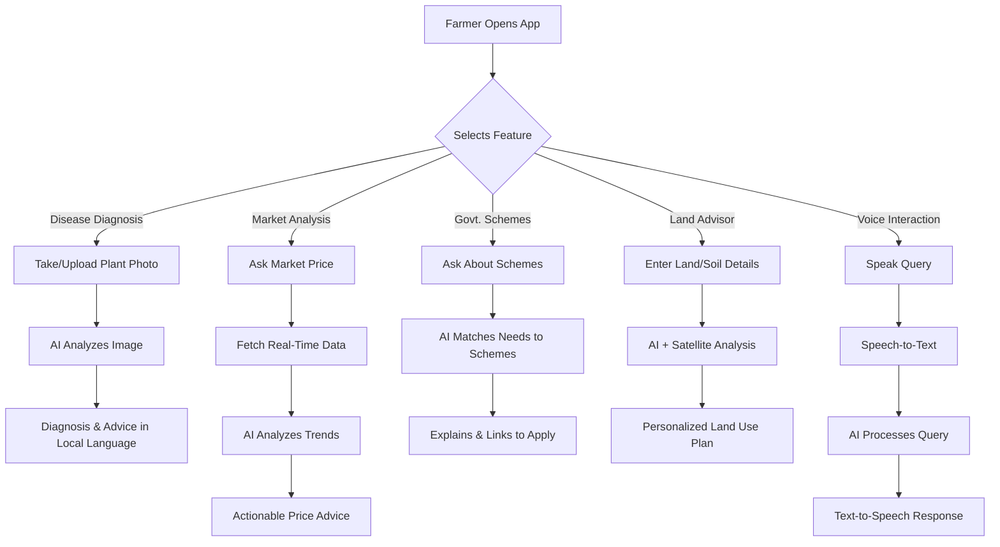
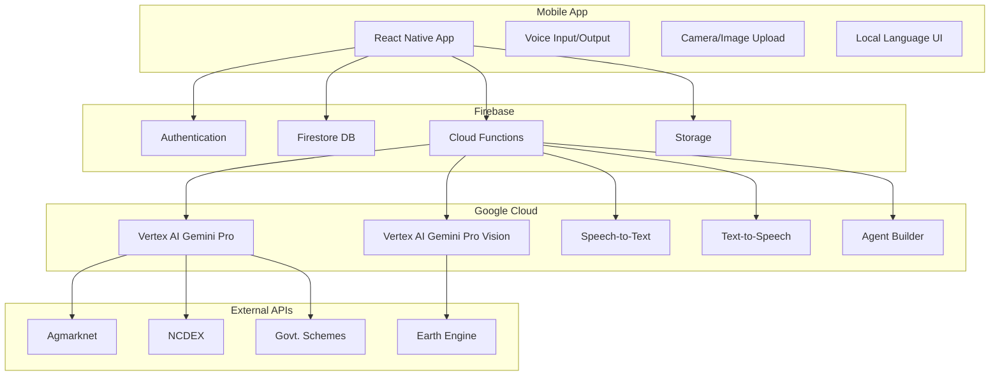

# Project Kisan - Visuals & Diagrams

## 1. Process Flow Diagram



---

## 2. Use-Case Diagram

```mermaid
usecase
  actor Farmer
  actor Expert
  actor Government
  Farmer -- (Diagnose Crop Disease)
  Farmer -- (Get Market Prices)
  Farmer -- (Apply for Schemes)
  Farmer -- (Get Land Utilization Advice)
  Farmer -- (Voice Interaction)
  Expert -- (Validate AI Diagnosis)
  Government -- (Provide Scheme Data)
  (Diagnose Crop Disease) ..> (AI System) : <<include>>
  (Get Market Prices) ..> (Market Data API) : <<include>>
  (Apply for Schemes) ..> (Govt. Portal) : <<include>>
  (Get Land Utilization Advice) ..> (Satellite Data API) : <<include>>
```

---

## 3. Architecture Diagram



---

## 4. Wireframes / Mock Diagrams (Textual Description)

### Home Screen
- Large voice button ("Ask your question")
- Quick access: Diagnose Disease, Market Prices, Schemes, Land Advisor
- Language selector at top

### Disease Diagnosis
- Camera view with "Take Photo" button
- Upload from gallery option
- Result screen: Disease name, solution, local remedies, voice playback

### Market Analysis
- Input: "Which crop?" (voice/text)
- Output: Current prices, trend graph, best time to sell, voice summary

### Government Schemes
- Search bar: "What do you need?"
- List of matched schemes with icons
- Tap for details: eligibility, benefits, apply link, voice explanation

### Land Utilization Advisor
- Form: Land size, soil type, location (voice/text)
- Output: Crop plan, technology suggestions, satellite map, voice advice

---

*For actual presentation, use these diagrams in Mermaid-compatible tools or convert to images for slides. Wireframes can be sketched based on the above descriptions.* 